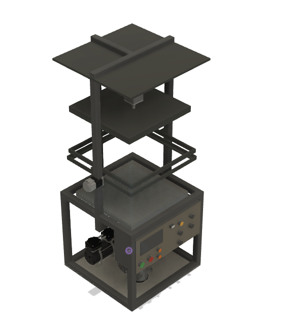

<!DOCTYPE html>
<html lang="es">
<head>
    <meta charset="UTF-8">
    <meta name="viewport" content="width=device-width, initial-scale=1.0">
    <title>F.A.A.L. I - Termoformadora</title>
    <link rel="stylesheet" href="styles.css">
</head>
<body>
    <header>
         <!-- Añadir el logo del proyecto -->
        <h1>EXPO TECNICA 2024</h1>
        
6to "A" Electromecánica

    </header>

    <main>
        <section class="description">
            <h2>DESCRIPCIÓN:</h2>
            
La termoformadora al vacío F.A.A.L 1, desarrollada para las Olimpiadas de Electromecánica, es una máquina educativa con capacidad para aplicaciones industriales. Su funcionamiento consiste en calentar una lámina de plástico y aplicar vacío para moldearla en una matriz. Incluye modos de operación manual y automático, una estructura robusta y componentes como resistencias de alta potencia, pistones neumáticos y un sistema de refrigeración, asegurando un proceso eficiente y controlado.

        </section>

        <section class="content">
            

                
            

            
            

                <h3>PARTES:</h3>
                <ul>
                    <li>Porta-lámina.</li>
                    <li>Receptáculo de resistencias.</li>
                    <li>Receptáculo de molde.</li>
                    <li>Sistema de pistones neumáticos.</li>
                    <li>Bomba de vacío.</li>
                    <li>Sistema de refrigeración.</li>
                    <li>Sistema de control.</li>
                    <li>Panel de mando.</li>
                </ul>
            

        </section>

        <section class="links">
            <h3>Enlaces adicionales:</h3>
            <ul>
                <li><a href="Olimpiadas Electromecanica_EPET_N1_unesco F.A.AL1.pdf" target="_blank">Informe en PDF</a></li>
                <li><a href="https://viewer.autodesk.com/id/dXJuOmFkc2sub2JqZWN0czpvcy5vYmplY3Q6YTM2MHZpZXdlci1wcm90ZWN0ZWQvdDE3MzMxNDMyODVfZDQzOTg5OWItZWI1OC00MzBlLTk0ZGUtM2Y1NWE3MDRjNjdiLnN0bA?sheetId=Y2NiYjY1NzUtMmM1YS00MGIyLThiNjktMDlhOTM0ZGNmNWVj">Vista 360° de la máquina</a></li>
            </ul>
        </section>
    </main>

    <footer>
        
OLIMPIADAS DE ELECTROMECANICA INSTANCIA NACIONAL 2024

        
+ info en: <a href="https://instagram.com/ProyectoFaal1" target="_blank">@ProyectoFaal1</a>

    </footer>
</body>
</html>
